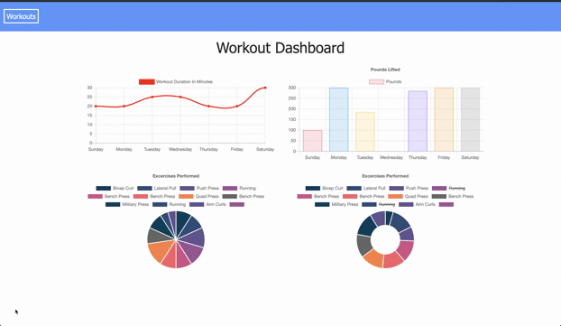
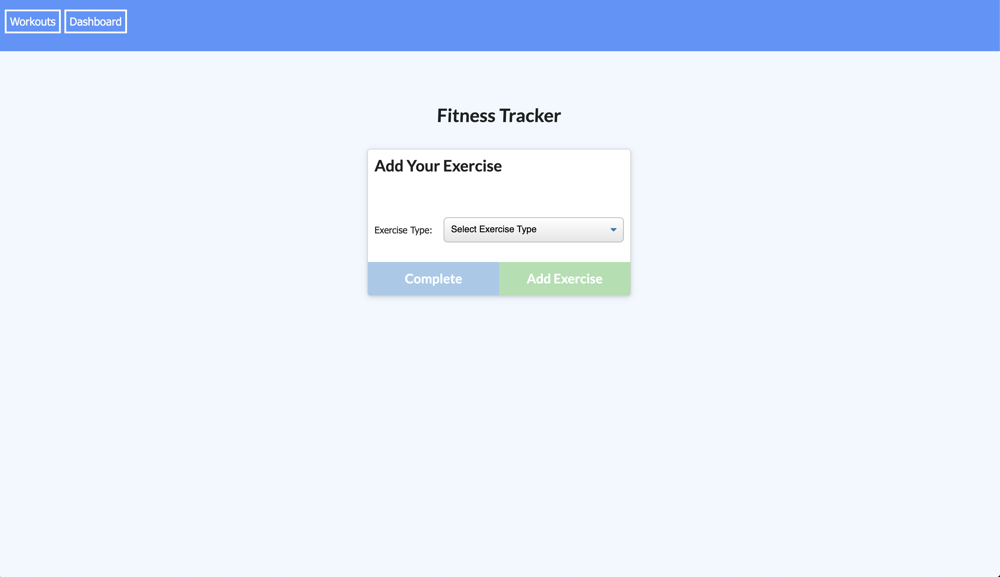
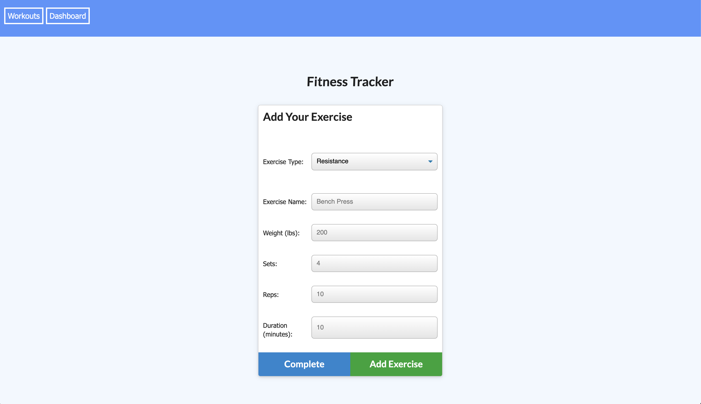
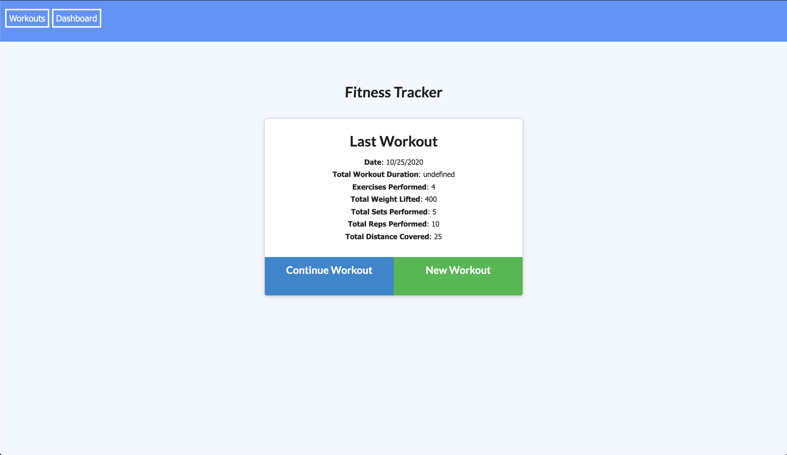
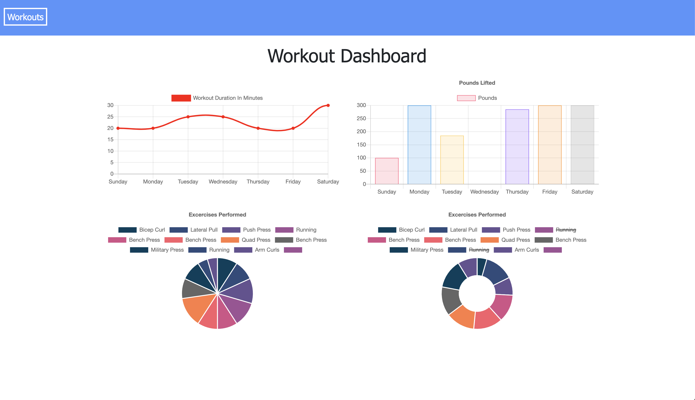

# FITNESS TRACKER

## Description
Fitness Tracker is a web based application that allows the user to monitor and measure their fitnss goals and keep a digital record of their progress. The user will be able to track the name, type, weight, sets, reps, and duration of each exercise, and to log the distance for cardio exercises. Fitness Tracker is an easy The applicatons core fucntioning is backed with Mongo database and routes supported by Express.   

## Video

## Screen Shots
| | |
|:-------------------------:|:-------------------------:|
| screen shot 1|  screen shot 2|
| screen shot 3| screen shot 4|

## Technology
* [MongoBD](https://www.mongodb.com/)
* [Express](https://www.npmjs.com/package/express)
* [Heroku](https://devcenter.heroku.com/categories/reference)
* [Node.js](https://nodejs.org/en/)
* [npmjs](https://docs.npmjs.com/)
* [HTML](https://developer.mozilla.org/en-US/docs/Web/HTML)
* [CSS](https://developer.mozilla.org/en-US/docs/Web/CSS)
* [Boostrap](https://getbootstrap.com/)

## License 
 
   *MIT License*

## Authors
**Payton Banks**
- [LinkedIn](https://www.linkedin.com/feed/)
- [Github](https://github.com/paytonbanks)
- [Email](mailto:payton.banks@gmail.com)

## Client Project Site
*link:*
[Fitness Tracker](https://obscure-beach-49755.herokuapp.com/)